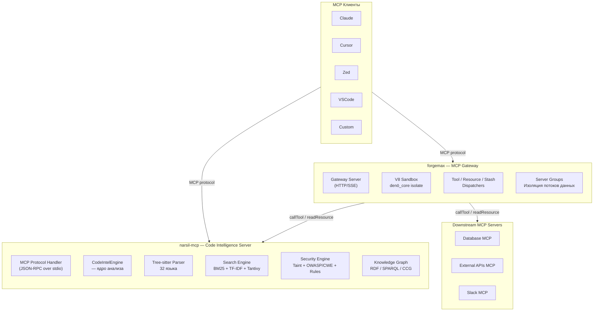
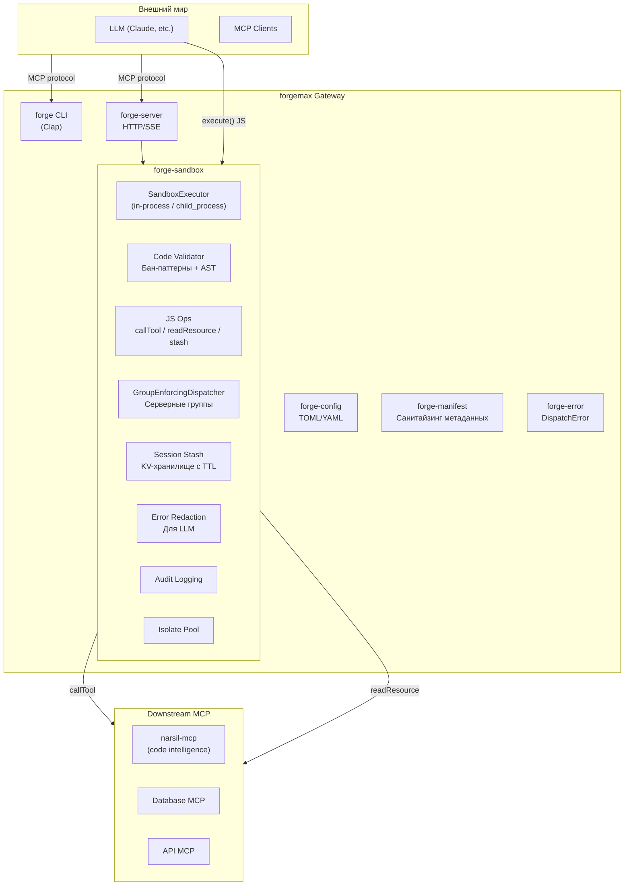
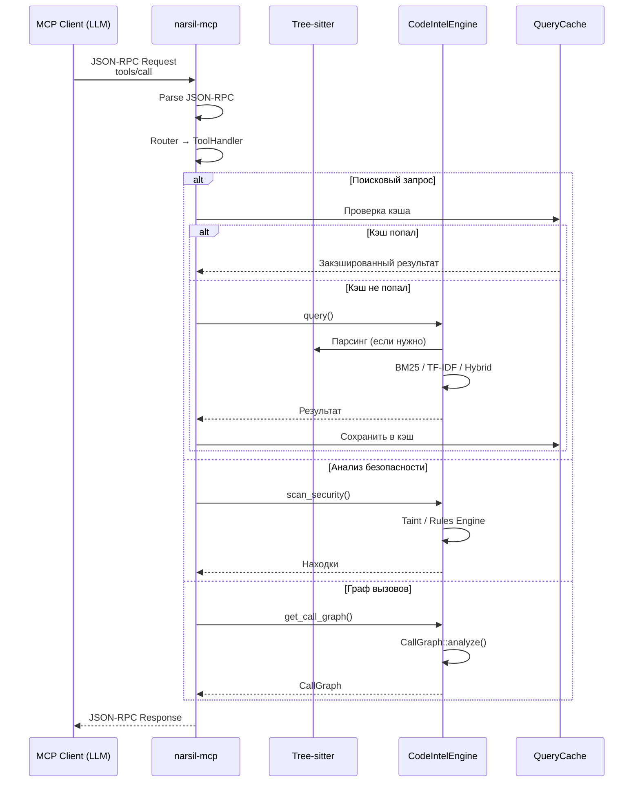

# narsil-mcp

> Монорепозиторий для сверхбыстрого MCP-сервера code intelligence и многосерверного MCP gateway/sandbox.

[](/src/narsil-mcp/LICENSE-MIT)
[](https://www.rust-lang.org)

---

## Состав проекта

Проект состоит из двух независимых Rust-компонентов, связанных концептуально:

| Компонент | Версия | Описание |
|-----------|--------|----------|
| [**narsil-mcp**](/src/narsil-mcp) | v1.7.0 | MCP-сервер code intelligence — парсинг, поиск, анализ кода (90 инструментов) |
| [**forgemax**](/src/forgemax) | v0.6.0 | Многосерверный MCP gateway с V8 sandbox для выполнения LLM-генерированного JS-кода |

---

## Архитектура

### Высокоуровневая схема



### Внутренняя архитектура narsil-mcp

```mermaid
flowchart LR
    subgraph IO["Ввод/Вывод"]
        STDIO["STDIO\n(JSON-RPC)"]
        HTTP["HTTP Server\n(фронтенд)"]
        WASM["WASM\n(браузер)"]
    end

    subgraph Core["Ядро"]
        MCP["MCP Handler"]
        Registry["ToolRegistry\n90 обработчиков"]
        Filter["ToolFilter\nПресеты: Minimal/Balanced\nFull/SecurityFocused"]
    end

    subgraph Engine["CodeIntelEngine"]
        Index["Индексация\nSymbolIndex + FileCache"]
        Parser["LanguageParser\n32 языка tree-sitter"]
        SearchBM25["BM25 Search\nConcurrentSearchIndex"]
        Embeddings["TF-IDF Embeddings\nПоиск похожего кода"]
        Hybrid["Hybrid Search\nRRF Fusion"]
        Neural["Neural Engine\nVoyage AI / OpenAI"]
    end

    subgraph Analysis["Анализ"]
        CG["Call Graph\nГраф вызовов"]
        CFG["Control Flow Graph\nБазовые блоки"]
        DFG["Data Flow Graph\nDef-Use цепи"]
        DeadCode["Dead Code\nDetection"]
        TypeInf["Type Inference\nPython/JS/TS"]
        Taint["Taint Analysis\nSQLi / XSS / RCE"]
        SecRules["Security Rules\nOWASP / CWE / Crypto"]
        SupplyChain["Supply Chain\nSBOM / OSV / Licenses"]
    end

    subgraph Storage["Хранение"]
        Cache["Cache\nQueryCache + AnalysisCache"]
        Persist["Persist Index\nPostcard + memmap2"]
        GraphDB["RDF Graph\nOxigraph / SPARQL"]
        CCG["Code Context Graph\nJSON-LD Layers L0-L3"]
    end

    IO --> Core
    Core --> Engine
    Engine --> Analysis
    Engine --> Storage
```



### Внутренняя архитектура forgemax



### Поток данных при запросе



### Защита в глубину (forgemax)

```mermaid
flowchart LR
    subgraph Layer1["Layer 1: Code Validation"]
        V1["Pre-execution validator\nБан-паттерны"]
        V2["AST Validator (oxc)\nUnicode homoglyph"]
        V3["Content size limits"]
    end

    subgraph Layer2["Layer 2: V8 Isolation"]
        I1["V8 Isolate\nНет fs/net/env"]
        I2["Bootstrap\neval/Function удалены"]
        I3["Fresh per call\nНет состояния между вызовами"]
    end

    subgraph Layer3["Layer 3: Dispatcher"]
        D1["GroupEnforcingDispatcher\nstrict/open изоляция"]
        D2["Circuit Breaker\nClosed/Open/HalfOpen"]
        D3["Per-server timeouts"]
        D4["Rate limiting"]
    end

    subgraph Layer4["Layer 4: Output"]
        O1["Error Redaction\nURL/IP/creds/stacks"]
        O2["Manifest Sanitisation\nАнти prompt injection"]
        O3["Output size limits"]
    end

    Layer1 --> Layer2 --> Layer3 --> Layer4
```



---

## Быстрый старт

### Запуск narsil-mcp

```bash
# Из корня проекта через submodule
cd src/narsil-mcp
cargo run --release -- --repos /path/to/your/repo
```

**Note:** narsil-mcp is a Rust-only project — no Python/FastAPI entry point.

### Подключение forgemax к narsil-mcp

```toml
# forge.toml
[servers.narsil]
command = "narsil-mcp"
args = ["--repos", "./my-project", "--preset", "full"]
transport = "stdio"
timeout_secs = 30
circuit_breaker = true

[sandbox]
timeout_secs = 60
max_heap_mb = 256
max_concurrent = 4
```

---

## Ключевые возможности

### narsil-mcp (90 инструментов)

| Категория | Инструменты | Возможности |
|-----------|-------------|-------------|
| **Репозиторий** | 8 | Структура проекта, навигация по файлам, реиндексация |
| **Символы** | 7 | Поиск символов, референсы, export map, fuzzy search |
| **Поиск** | 12 | BM25, TF-IDF, гибридный, нейронный, чанки, семантические клоны |
| **Call Graph** | 6 | Граф вызовов, callers/callees, сложность, hotspots |
| **Control Flow** | 2 | CFG, мёртвый код |
| **Data Flow** | 4 | Def-Use, reaching defs, dead stores |
| **Type Inference** | 3 | Инференс типов, type errors, taint + types |
| **Security** | 9 | Taint, OWASP, CWE, сканирование, фиксы |
| **Supply Chain** | 4 | SBOM (CycloneDX/SPDX), OSV, лицензии, апгрейды |
| **Git** | 9 | Blame, история, hotspots, коммиты, диффы |
| **LSP** | 3 | Hover, type info, go to definition |
| **Remote** | 3 | GitHub API: clone, list, fetch |
| **Graph/SPARQL** | 14 | RDF, SPARQL, CCG (Code Context Graph L0-L3) |

### forgemax

| Компонент | Описание |
|-----------|----------|
| **Sandbox** | V8 isolate (deno_core) для безопасного выполнения JS-кода LLM |
| **Server Groups** | `strict` / `open` изоляция потоков данных между MCP-серверами |
| **Circuit Breaker** | Closed → Open → HalfOpen для устойчивости к сбоям |
| **Error Redaction** | Многослойная редукция ошибок для LLM |
| **Audit** | Полное логгирование всех вызовов |
| **Stash** | Per-session KV-хранилище с TTL и групповой изоляцией |

---

## Сборка

### Структура проекта

```
.
├── AGENTS.md                    # Правила для AI-агентов
├── Makefile                     # Корневой make: сборка обоих компонентов
├── README.md                    # Эта документация
├── build/
│   ├── narsil-mcp/              # Сборочная инфраструктура narsil-mcp
│   │   ├── Makefile             # Цели: release, debug, deb, test, clean
│   │   ├── README.md            # Документация сборки
│   │   └── target/              # Cargo target (изолирован от исходников)
│   └── forgemax/                # Сборочная инфраструктура forgemax
│       ├── Makefile             # Цели: release, debug, deb, test
│       ├── README.md
│       └── target/
├── deb/
│   ├── narsil-mcp/              # Debian-пакетинг narsil-mcp
│   │   └── DEBIAN/
│   │       ├── control          # Метаданные пакета (@VERSION@, @ARCH@)
│   │       ├── postinst         # Постустановочный скрипт
│   │       └── postrm           # Скрипт удаления
│   └── forgemax/                # Debian-пакетинг forgemax
│       └── DEBIAN/
│           ├── control
│           ├── postinst
│           └── postrm
├── src/
│   ├── narsil-mcp/              # Git submodule: MCP code intelligence server
│   └── forgemax/                # Git submodule: MCP gateway sandbox
```

**Важно:** `src/narsil-mcp` и `src/forgemax` — git submodules. Их содержимое изменяется в upstream-репозиториях.

```bash
# Инициализация submodules после клонирования
git submodule update --init --recursive

# Обновление до последних версий
git submodule update --remote --merge
```

### Сборка из корня

```bash
make            # собрать всё (narsil-mcp + forgemax, release + deb)
make narsil-mcp # только narsil-mcp
make forgemax   # только forgemax
make deb        # все .deb пакеты
make install    # установить все .deb пакеты
make test       # запустить тесты обоих компонентов
make clean      # очистить всё
```

### Быстрая сборка narsil-mcp

```bash
# Полная сборка: frontend + Rust + .deb пакет
make -C build/narsil-mcp

# Only release-сборка (без deb)
make -C build/narsil-mcp release

# Debug-сборка
make -C build/narsil-mcp debug

# Only фронтенд
make -C build/narsil-mcp frontend

# Frontend dev server (hot-reload)
make -C build/narsil-mcp frontend-dev

# Запуск тестов
make -C build/narsil-mcp test
```

Результат:
- Бинарник: `build/narsil-mcp/target/release/narsil-mcp`
- .deb пакет: `deb/narsil-mcp_<version>_<arch>.deb`

### Быстрая сборка forgemax

```bash
# Полная сборка: Rust + .deb пакет
make -C build/forgemax

# Debug-сборка
make -C build/forgemax debug

# Запуск тестов
make -C build/forgemax test
```

Результат:
- Бинарники: `build/forgemax/target/release/{forgemax,forgemax-worker}`
- .deb пакет: `deb/forgemax_<version>_<arch>.deb`

### .deb пакет

```bash
# Сборка .deb пакетов обоих компонентов из корня
make deb

# Или по отдельности
make -C build/narsil-mcp deb
make -C build/forgemax deb

# Сборка и установка через dpkg
make install
```

Версия подхватывается из `Cargo.toml`, архитектура — из системы.

### Пошагово (без Makefile)

```bash
# 1. Фронтенд
cd src/narsil-mcp/frontend
npm ci && npm run build

# 2. Rust
cd ..
cargo build --release \
    --target-dir ../../build/narsil-mcp/target \
    --no-default-features \
    --features native,graph,frontend,neural

# Бинарник: build/narsil-mcp/target/release/narsil-mcp
```

---

## Разработка

**Note:** `src/narsil-mcp` и `src/forgemax` are git submodules. Code changes must be made in upstream repositories.

Смотрите также:
- [AGENTS.md](./AGENTS.md) — правила работы с проектом
- [NARSIL.usage.md](./NARSIL.usage.md) — руководство по narsil-mcp (preset tool counts)
- [FORGEMAX.usage.md](./FORGEMAX.usage.md) — руководство по forgemax
- [Документация narsil-mcp](./src/narsil-mcp/README.md) — полный список инструментов, установка, конфигурация
- [Документация forgemax](./src/forgemax/README.md) — архитектура безопасности, примеры
- [Архитектура безопасности forgemax](./src/forgemax/ARCHITECTURE.md) — defense-in-depth, server groups, circuit breakers
